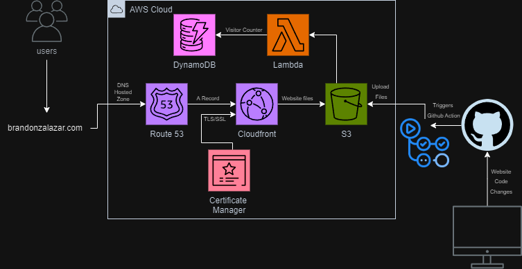

# Cloud-resume

This project aimed to transform my personal website by leveraging cloud technologies, inspired by Forrest Brazels "The Cloud Resume Challenge." 
I developed a portfolio of serverless web applications using AWS, incorporating key services such as S3, CloudFront, DynamoDB, Lambda, Route 53, and also CI/CD with GitHub Actions.

You can see the website at [brandonzalazar.com](https://brandonzalazar.com).

## How it works


#### Cloud Resume Architecture


### Domain and Routing
The domain brandonzalazar.com is hosted within my DNS Hosted Zone on AWS Route 53.
Users accessing brandonzalazar.com are redirected to my CloudFront distribution via an A record (a DNS record that maps a domain name to the corresponding IPv4 address of a resource such as CloudFront in this example).

### Secure Communication
AWS Certificate Manager provides the **SSL certificate ** to enable secure communication to the CloudFront distribution.

### Serving Website Files & CI/CD Integration
   - **CloudFront** serves the website files directly from an **S3 bucket**.
   - These files are updated in the S3 bucket directly from code changes made in this repository. This is facilitated by **GitHub Actions**, which applies CI/CD every time it detects changes in the website folder of this repository.
   - The CI/CD process is defined by the `ci-cd.yml` file located in `.github/workflows` of this repository.
   - This GitHub Actions workflow is triggered whenever there is a push event on the “main” branch of the repository.
   - Sensitive information required for this process is stored in environment variables using **GitHub Secrets** (`AWS_S3_BUCKET`, `AWS_ACCESS_KEY_ID`, `AWS_SECRET_ACCESS_KEY`).

### View Counter
   - A **View Counter** is added to track the number of visitors to the site using **DynamoDB**.
   - The `index.js` file for the site contains JavaScript code that retrieves the view count data from **Lambda** using the `fetch` function and updates the content of an HTML element with the “counter-number” class to display the count.
   - A table in **DynamoDB** stores the view counter data.
   - A **Lambda Function** written in Python retrieves and updates the view count in DynamoDB.

#### Lambda Function Code:


```python
import json
import boto3

dynamodb = boto3.resource('dynamodb')
table = dynamodb.Table('your-table-name')

def lambda_handler(event, context):
    response = table.get_item(Key={
        'id': '1'
    })
    views = response['Item']['views']
    views = views + 1
    print(views)
    response = table.put_item(Item={
        'id': '1',
        'views': views
    })
    
    return views
```